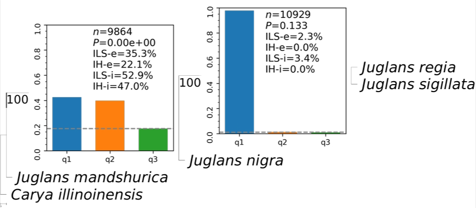
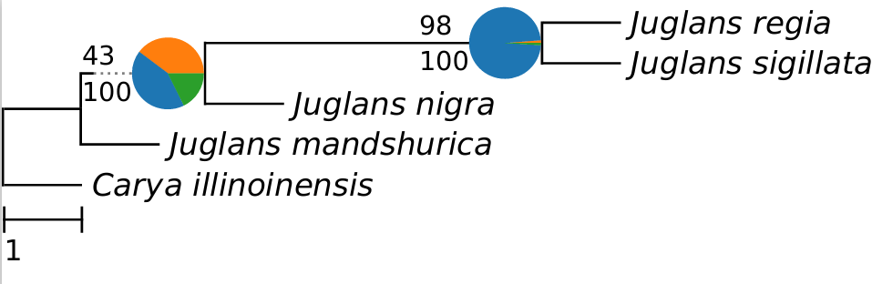

### Introduction ###
We defined the ILS/IH index to represent the degree of Incomplete lineage sorting (ILS) and introgression (IH) among lineages. This tool can quickly detect and visualize ILS/IH index between lineages of tree results run by ASTRAL option -u 2 or -t -2, with short running time, helping users to preliminatively determine ILS and IH and screen lineages for further analysis.  
Any nodes of phylogenetic tree can be regarded as consisting of two sister groups and one outgroup, and these three lineages can form three topologies q1, q2, q3 (as shown in the figure below),The topology with the highest proportion is denoted as q1. ILS/IH index is calculated based on the number and proportion of these topologies. For more details of ILS/IH index, please see 待加


**Figure. The three topological structures of gene trees** Any combination of three lineages produces three topologies, When the ILS index is at its maximum of 100% and there is no IH, we expect q1 = q2 = q3 = 100%/3. When the IH index reaches 50% and there is no ILS, q1 = q2 = 50% is expected.  

The below is an example of output figures of Phytop:

**Figure. Visual result of Phytop on example data with default parameters.** n represents the number of simulated gene trees, P is the p-value of χ2 test to check whether the number of topologies q2 and q3 are equal, ILS-i and IH-i represent the calculated ILS index and IH index respectively, and ILS-e and IH-e represent the proportion of gene tree topological incongruence that can be explained by the ILS and IH, respectively.

**Figure. Visual result of Phytop on example data with "-pie -cp" parameters.** In the pie chart, only the proportions of the q1 topologies are shown
### Quick install and start ###
install Phytop in current path
```
git clone https://github.com/zhangrengang/phytop
cd phytop

# install
conda env create -f phytop.yaml
conda activate phytop
python setup.py install
```

start
```
cd example_data
```
get barcharts
```
phytop astral.tree
```
barcharts with collapse for clades
```
phytop astral.tree -clades setcladefile -collapse
```
barcharts displays a selection of nodes
```
phytop astral.tree -clades setcladefile -onshow Juglans1
```
get piecharts
```
phytop astral.tree -pie -cp
```

### INPUT ###
When runing ASTRAL, please use `-u 2` (for [C++ version](https://github.com/chaoszhang/ASTER), including `astral`, `astral-pro` and `astral-hybrid` etc.) or 
`-t 2` (for [JAVA version](https://github.com/smirarab/ASTRAL/), including ASTRAL-III and ASTRAL-MP) option. Then, the output species tree from ASTRAL can be used as input to `phytop`.
### Outputs ###
```
├── /tmp          # Transition File (unused)
├── *.pdf         # Visualization of the tree file generated by astral
├── *.info.tsv    # The specific value of each node
```
### Usage ###
```
usage: phytop [-h] [-alter NEWICK] [-g NEWICK] [-align] [-cp] [-branch_size BRANCH_SIZE] [-leaf_size LEAF_SIZE] [-sort]
              [-notext] [-figsize FIGSIZE] [-fontsize FONTSIZE] [-figfmt FIGFMT] [-polytomy_test] [-pie] [-pie_size PIE_SIZE]
              [-pie_fold PIE_FOLD] [-bl] [-test [TAXON/FILE [TAXON/FILE ...]]] [-astral_bin STR] [-outgroup STR]
              [-clades FILE] [-collapse [TAXON/FILE [TAXON/FILE ...]]] [-onshow TAXON/FILE [TAXON/FILE ...]]
              [-noshow TAXON/FILE [TAXON/FILE ...]] [-subset TAXON/FILE [TAXON/FILE ...]] [-pre STR] [-tmp DIR]
              NEWICK

Visualizing ILS/IH signals on species tree from ASTRAL.

optional arguments:
  -h, --help            show this help message and exit

Input:

  NEWICK                Species tree output by ASTRAL (using option `-u 2` for C++ versions and `-t 2` for JAVA versions)
                        [required]
  -alter NEWICK         Show the tree (e.g. a timetree) instead of the ASTRAL tree (their topologies MUST be identical)
                        [default=None]
  -g NEWICK, -genetrees NEWICK
                        gene trees for branch lengths in TEST mode [default=None]

Tree options:

  -align                Align tips [default=False]
  -cp, -concordance_percent
                        Show gene-species trees concordance percent at inner nodes instead of PP [default=False]
  -branch_size BRANCH_SIZE
                        Font size of text in branch [default=48]
  -leaf_size LEAF_SIZE  Font size of leaf name [default=60]

Barcharts options:

  -sort                 Sort q1, q2 and q3, which will miss the directionality [default=False]
  -notext               Do not draw text on the barcharts [default=False]
  -figsize FIGSIZE      Figure size of barcharts [default=3]
  -fontsize FONTSIZE    Font size of text in barcharts [default=13]
  -figfmt FIGFMT        Figure format of barcharts in tmpdir [default=png]
  -polytomy_test        Test for polytomies [default=False]

Piecharts options:

  -pie, -pie_chart      Use piechart instead of barchart [default=False]
  -pie_size PIE_SIZE    Size of Piecharts [default=30]
  -pie_fold PIE_FOLD    Fold of font size between Barcharts and Piecharts [default=6]
  -bl                   Branch lengths to check [default=False]

Branch length (BL) options:

Test mode:

  -test [TAXON/FILE [TAXON/FILE ...]]
                        Test four-taxon (the first is outgroup and others are sampled for three ingroups) [default=None]
  -astral_bin STR       ASTRAL command ('astral-pro', 'astral-hybrid', ...) [default=astral-pro]
  -outgroup STR         Outgroup [default: the first of `-test`]

Clade operateion:

  -clades FILE          Difinition of clades [default=None]
  -collapse [TAXON/FILE [TAXON/FILE ...]]
                        Collapse clades [default=None]
  -onshow TAXON/FILE [TAXON/FILE ...]
                        Only show charts on these inner nodes [default=None]
  -noshow TAXON/FILE [TAXON/FILE ...]
                        Don't show charts on these inner nodes [default=None]
  -subset TAXON/FILE [TAXON/FILE ...]
                        Show a subset clade with their MCRA [default=None]

Output:

  -pre STR, -prefix STR
                        Prefix for output [default=None]
  -tmp DIR, -tmpdir DIR
                        Temporary directory [default=tmp]
```